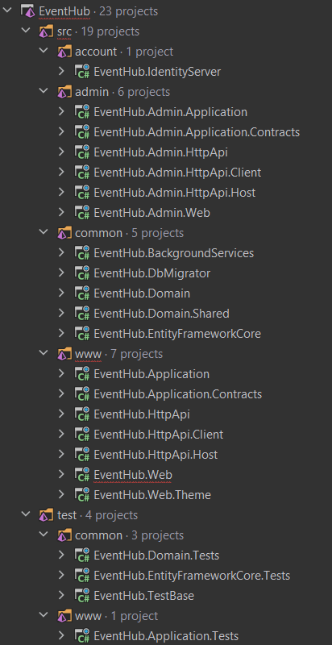

# EventHub

This is a reference application built with the ABP Framework. It implements Domain Driven Design with multiple application layers.

## The book

This solution is originally prepared to be a real-world example for the **Mastering ABP Framework** book.

**The book is the only source that explains the solution**. The solution is highly referred in *Understanding the Reference Solution*, *Domain Driven Design* and other parts of the book.

**You can order the book on [Amazon](https://www.amazon.com/gp/product/B097Z2DM8Q) or on [Packt's website](https://www.packtpub.com/product/mastering-abp-framework/9781801079242).**

## Solution Structure

The main solution structure of this application is like in the image above. It is mainly separated into two folders (and multiple projects under these folders) named **src** (which contains all application codes) and **test** (which contains all related tests).

### src

The application codes are separated into four folders: **account**, **admin**, **common** and **www**.

* **account**: Contains a single project named `EventHub.IdentityServer`. It's the central identity server of the application. All applications (public web application and back-office/admin application) use this server for authentication/authorization purposes.

* **admin**: Contains admin-side projects of the solution. All admin-related operations are under of these folders. UI is **Blazor WASM** for the admin side.

* **common**: Contains common services and infrastructure details such as **background services**, **database migrator**, **entity framework core** etc.

* **www**: Contains public website projects of the solution. All public website operations are under of these folders. UI is **MVC/Razor Pages** for the public web-side.

### test

Contains tests of the application codes.

## Requirements

* .NET 6.0+
* Docker

## How to run

* Run `etc/docker/up.ps1` before running the solution.
* Run `EventHub.DbMigrator` to create the database and seed initial data.
* Run `EventHub.IdentityServer`
* Run `EventHub.HttpApi.Host`
* Run `EventHub.Web`
* Run `EventHub.Admin.HttpApi.Host`
* Run `EventHub.Web.Admin`

`admin` user's password is `1q2w3E*`

## See live

See the solution live on https://openeventhub.com

## Screenshots

### Public Web Side - (MVC/Razor Page UI)

#### Home Page

#### Events Page

#### Event Detail Page

#### Organizations Page

#### Profile Page

#### Payment Module Pages

The payment module provides an API to make payments via using **PayPal** easily. This application uses this module to perform payment transactions.

> To learn more about the **Payment Module** and see the integration, please see the [payment module documentation](modules/payment/README.md).

##### Pricing Page

#### Pre Checkout Page

